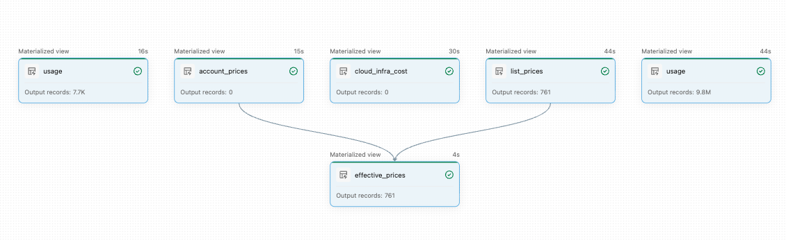
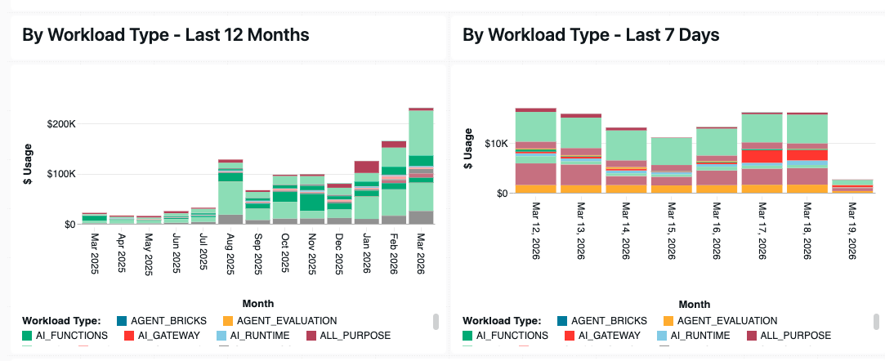

**This is not an official Databricks product or solution. It is provided as-is, without warranty or official support.**

# System Tables Sync & Usage Dashboard

A Databricks Asset Bundle (DAB) that dynamically discovers and copies **all accessible system tables** into a dedicated `system_sync` catalog, then deploys a multi-page usage analytics dashboard on top of them.

The dashboard provides detailed visibility into billing, compute, jobs, queries, and user-level consumption. Pricing is calculated using an `effective_prices` table that automatically uses **customer-negotiated pricing** (`account_prices`) when available, or falls back to **public list pricing** (`list_prices`) otherwise — ensuring accurate cost reporting regardless of your pricing model.

Because the dashboard reads from pre-computed physical Delta tables (not system tables directly), it loads instantly and filters respond without delay.

## Table of Contents

- [Components](#components)
- [Prerequisites](#prerequisites)
- [Installation](#installation)
  - [Option A: Databricks UI (Git Folder)](#option-a-databricks-ui-git-folder)
  - [Option B: CLI](#option-b-cli)
- [After Deployment](#after-deployment)
- [Project Structure](#project-structure)
- [Customization](#customization)
- [Troubleshooting](#troubleshooting)

## Components

### Scheduled Job

A daily job (6:00 AM UTC) with two sequential tasks:

1. **`create_catalog`** — SQL notebook that runs `CREATE CATALOG IF NOT EXISTS system_sync` on your SQL warehouse
2. **`run_sync_pipeline`** — Triggers the SDP pipeline below (full refresh)

### SDP Pipeline: Dynamic System Table Sync

A serverless Spark Declarative Pipeline that automatically discovers all readable tables under the `system` catalog, copies them as physical Delta tables into `system_sync`, and builds a derived `effective_prices` table. Tables are fully overwritten on each run. Inaccessible tables are gracefully skipped.



### Lakeview Dashboard

A 7-page AI/BI dashboard providing detailed visibility into billing, compute, jobs, queries, and per-user consumption — with executive summaries, top-N breakdowns, daily/monthly trends, and performance tuning insights. The dashboard reads from the synced Delta tables, so it loads instantly and filters respond without delay.



> The pipeline syncs **all** accessible system tables — the dashboard uses a subset, but additional tables are available for ad-hoc queries.

## Prerequisites

**Permissions:**

| Permission | Why |
|---|---|
| **CREATE CATALOG** on the metastore | Creates the `system_sync` catalog |
| **USE CATALOG** on `system` | Reads source system tables |
| **SELECT** on `system.*.*` | Reads individual tables (skips any without access) |

**Infrastructure:**

- **SQL Warehouse** (Serverless, Pro, or Classic) — you'll need its **name** (UI deploy) or **ID** (CLI deploy)
- **Unity Catalog** enabled on the workspace
- **Serverless compute** enabled (for the SDP pipeline)

> System tables must be enabled at the account level. If `system.billing.usage` is not visible, ask your account admin to [enable system tables](https://docs.databricks.com/en/administration-guide/system-tables/index.html).

## Installation

---

### Option A: Databricks UI (Git Folder)

No CLI needed. Deploy directly from the workspace.

**1. Create Git Folder**

**Workspace** → your user folder → **⋮** → **Create** → **Git Folder** → enter `https://github.com/omriaf/system_sync.git` → **Create**

**2. Set Your Warehouse**

Open `databricks.yml` in the Git folder. Add a `lookup` with your warehouse name:

```yaml
variables:
  warehouse_id:
    description: SQL warehouse ID for the dashboard and catalog creation task
    lookup:
      warehouse: "My Warehouse Name"    # <-- replace with your warehouse name
```

Save the file.

**3. Deploy**

Open `databricks.yml` → click the **deployments icon** (🚀 rocket) in the left sidebar → select the **dev** target → click **Deploy**

**4. Run**

In the Deployments pane, find `system_sync_daily` under Bundle resources → click **▶** to run.

First run takes **5–15 minutes**.

**5. Open Dashboard**

**SQL** → **Dashboards** → search for **"Detailed Usage Dashboard- Account Pricing"**

> See [Deploy bundles from the workspace](https://docs.databricks.com/en/dev-tools/bundles/workspace-deploy) for more details.

---

### Option B: CLI

**1. Install CLI and authenticate**

```bash
# Install: https://docs.databricks.com/en/dev-tools/cli/install.html
databricks configure                    # or: databricks auth login --host <URL>
```

**2. Clone and deploy**

```bash
git clone https://github.com/omriaf/system_sync.git && cd system_sync
databricks bundle validate --var="warehouse_id=<YOUR_WAREHOUSE_ID>"
databricks bundle deploy --var="warehouse_id=<YOUR_WAREHOUSE_ID>"
```

**3. Run initial sync**

```bash
databricks bundle run system_sync_daily --var="warehouse_id=<YOUR_WAREHOUSE_ID>"
```

**4. Open Dashboard**

**SQL** → **Dashboards** → search for **"Detailed Usage Dashboard- Account Pricing"**

---

## After Deployment

All resources are manageable from the Databricks UI:

- **Job**: **Workflows** → **Jobs** → `system_tables_daily_sync_job` — view runs, trigger manually, edit schedule
- **Pipeline**: **Pipelines** → `system_tables_daily_sync` — monitor updates, view lineage
- **Dashboard**: **SQL** → **Dashboards** → `Detailed Usage Dashboard- Account Pricing`
- **Tables**: **Catalog** → `system_sync` — browse all synced tables

## Project Structure

```
system_sync/
├── databricks.yml                                    # Bundle config (variable: warehouse_id)
├── pyproject.toml
├── resources/
│   ├── system_sync_etl.pipeline.yml                  # SDP pipeline (serverless, photon, complete refresh)
│   ├── system_sync_job.job.yml                       # Job: create_catalog → run_sync_pipeline
│   └── dashboard.yml                                 # Lakeview dashboard
└── src/
    ├── create_catalog.sql                            # CREATE CATALOG IF NOT EXISTS system_sync
    ├── dashboard.lvdash.json                         # Dashboard definition
    └── system_sync_etl/transformations/
        └── sync_system_tables.py                     # Dynamic discovery + sync + effective_prices
```

## Customization

**Change schedule** — edit `resources/system_sync_job.job.yml`:

```yaml
schedule:
  quartz_cron_expression: "0 0 6 * * ?"  # Default: daily at 6 AM UTC
  timezone_id: UTC
```

**Skip schemas** — edit `SKIP_SCHEMAS` in `sync_system_tables.py`:

```python
SKIP_SCHEMAS = {"ai", "information_schema", "storage"}  # add schemas to skip
```

## Troubleshooting

| Issue | Solution |
|---|---|
| `CATALOG_NOT_FOUND: system` | System tables not enabled — contact your account admin |
| `PERMISSION_DENIED: CREATE CATALOG` | Need metastore admin or `CREATE CATALOG` privilege |
| Pipeline discovers 0 tables | Check `SELECT` access on `system.*` tables |
| Dashboard shows no data | Verify the job completed successfully in **Workflows** → **Jobs** |
| `Warehouse not found` | Check warehouse ID/name is correct and warehouse is running |
